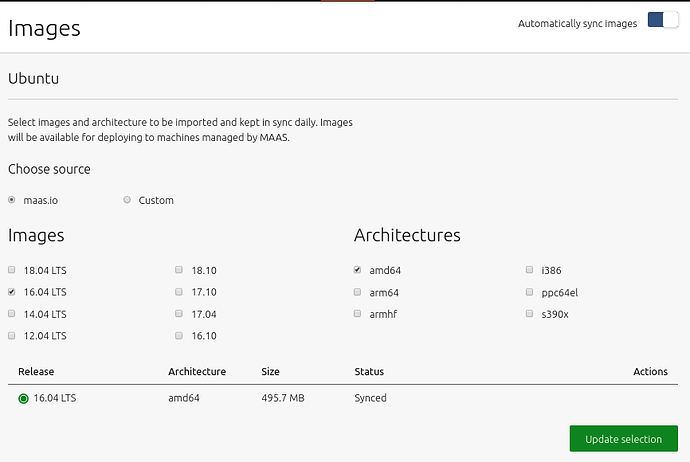
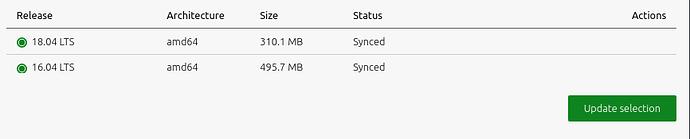
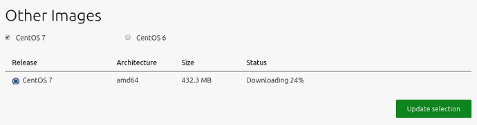

MAAS is only useful once it has images available to provision its nodes. Therefore, one key post-install task is to select and import images from the boot source. Once MAAS imports images, it will update them on an hourly basis, via a default synch mechanism.  This page explains how to select and import the images that MAAS requires to provision its nodes.

#### Quick questions you may have:

<!-- vanilla
* [How do I import standard images from maas.io?](/t/select-and-import-images/751#heading--import-maasio-image-ui)
* [How do I use other image mirrors to download images?](/t/select-and-import-images/751#heading--image-mirrors)
* [How do I import and provision non-Ubuntu images?](/t/select-and-import-images/751#heading--other-images)
* [How can I use the CLI to select and import images?](/t/cli-image-management/797#heading--select-images)
 vanilla -->

<!-- cli
* [How do I import standard images from maas.io?](/t/select-and-import-images/751#heading--import-maasio-image-ui)
* [How do I use other image mirrors to download images?](/t/select-and-import-images/751#heading--image-mirrors)
* [How do I import and provision non-Ubuntu images?](/t/select-and-import-images/751#heading--other-images)
* [How can I use the CLI to select and import images?](/t/cli-image-management/797#heading--select-images)
 cli -->

<!-- ui
* [How do I import standard images from maas.io?](/t/select-and-import-images/751#heading--import-maasio-image-ui)
* [How do I use other image mirrors to download images?](/t/select-and-import-images/751#heading--image-mirrors)
* [How do I import and provision non-Ubuntu images?](/t/select-and-import-images/751#heading--other-images)
 ui -->
 
Note that it is possible to build your own images in a limited sense: see [MAAS Image Builder](/t/maas-image-builder/1112).

<h2 id="heading--import-maasio-image-ui">Importing images from maas.io</h2>

<!-- vanilla
The 'Images' page shows what images and architectures have been selected and downloaded. By default, MAAS will automatically grab the most recent Ubuntu LTS releases (and amd64 architecture). Below, we have selected two additional releases:

 vanilla -->

<!-- ui
The 'Images' page shows what images and architectures have been selected and downloaded. By default, MAAS will automatically grab the most recent Ubuntu LTS releases (and amd64 architecture). Below, we have selected two additional releases:

 ui -->

<!-- cli
### ADD SUITABLE CLI EXPLANATION/EXAMPLE OR PRINTOUT ###
 cli -->

You can tell MAAS to sync images hourly, at the region level, using a toggle switch in the top-right corner of the screen.  See [Boot image sources](/t/images/754#boot-image-sources)) for more details. We highly recommended synching images hourly. Syncing at the rack controller level (from regiond) occurs every 5 min and cannot be disabled.

<!-- vanilla
Click the 'Save selection' button to initiate the import. MAAS will present existing images along with the newly-selected ones. The latter will have their status updated as the import is processed:

To remove an image, unselect it and click 'Save selection'.
 vanilla -->

<!-- ui
Click the 'Save selection' button to initiate the import. MAAS will present existing images along with the newly-selected ones. The latter will have their status updated as the import is processed:

To remove an image, unselect it and click 'Save selection'.
 ui -->

<!-- cli
### ADD SUITABLE CLI EXAMPLE OR PRINTOUT ###
 cli -->

<h2 id="heading--image-mirrors">Image mirrors</h2>

<!--vanilla
You can also host Ubuntu images on a mirror. Configure this mirror by selecting 'Custom' beneath 'Choose source'. Enter the mirror URL and click 'Connect'.

Advanced options, such as using a GPG key or keyring to validate the mirror path (snap installation location: /snap/maas/current/usr/share/keyrings/ubuntu-cloudimage-keyring.gpg), are revealed by clicking 'Show advanced options':

 vanilla -->

<!-- ui
You can also host Ubuntu images on a mirror. Configure this mirror by selecting 'Custom' beneath 'Choose source'. Enter the mirror URL and click 'Connect'.

Advanced options, such as using a GPG key or keyring to validate the mirror path (snap installation location: /snap/maas/current/usr/share/keyrings/ubuntu-cloudimage-keyring.gpg), are revealed by clicking 'Show advanced options':

 ui -->

<!-- cli
### ADD SUITABLE CLI EXPLANATION/EXAMPLE OR PRINTOUT ###
 cli -->

Optionally, a local mirror can be set up as the boot source. MAAS will then use it instead of the standard internet-based server. Local mirroring significantly reduces the time required import images. See [Local image mirror](/t/local-image-mirror/752) for instructions.

<h2 id="heading--other-images">Other images</h2>

<!-- vanilla
It is also possible to import and provision images other than Ubuntu. Images supported and provided by MAAS will appear beneath the 'Other Images' section. Currently, images for CentOS 6.6, CentOS 7.0, and CentOS 8.0 are available. These images can be imported and used just like the Ubuntu images above.
 vanilla -->

 vanilla -->

<!-- vanilla
It is also possible to import and provision images other than Ubuntu. Images supported and provided by MAAS will appear beneath the 'Other Images' section. Currently, images for CentOS 6.6, CentOS 7.0, and CentOS 8.0 are available. These images can be imported and used just like the Ubuntu images above.
 vanilla -->

 vanilla -->

<!-- cli
### ADD SUITABLE CLI EXAMPLE OR PRINTOUT ###
 cli -->
